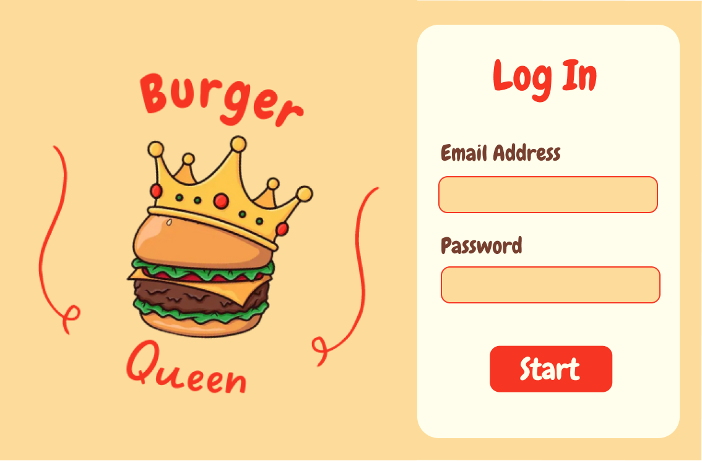

# Burger Queen 

## Index

* [1. Project Summary](#1-project-summary)
* [2. Inspiration and Design](#2-inspiration-and-design)
* [3. User Stories](#3-user-stories)
* [4. Final Version](#4-final-version)
* [5. Unit Tests](#5-unit-tests)
* [6. Credits and Acknowledgments](#6-credits-and-acknowledgments)

***

## 1. Project Summary

The objective of this project was to develop an application to manage a restaurant.

The tasks that we get the app to handle are the generation of orders, notification of orders ready to serve, as well as organization of workers and products; each of these layouts is only accessible to those with the appropriate permissions based on their role in the business.

To make the mentioned functionalities possible, we consumed data from a RESTful API mock and developed its CRUD, using `React`.

## 2. Inspiration and Design

We start the design process searching and reviewing the web apps of various fast-food restaurants for inspiration.

The color pallette choosen, according to users, it's associated with the field of restaurants, food, and even the sensation of hunger.

Being an app developed as SPA (Mobile First), prioritizing its use in tablet-type devices, we considered the legibility of the text, without leaving behind the style of the later, the size of the buttons and inputs, and the intuitiveness of its navigation.

## 3. User Stories

A total of eight user stories were written

### 1. Login

### 2. A waiter can create and cancel a new order 

### 3. Chefs can view pending orders chronologically 

### and 

### 4. Chefs can mark the orders as done once completed

### 5. Chefs can visualize the orders done but pending to be delivered to the clients by the waiters

### 6. Waiters can visualize the orders ready to be served and mark them as delivered to the clients 

### 7. Administrators can visualize, create, edit, and delete members of the staff

An example of the modals design for the confirmation of actions in the app, is the modal of adding a partner

### 8. Administrators can visualize, create, edit, and delete products in the warehouse

## 4. Final Version

For the deployment of the web app we use the platform [Netlify](https://www.netlify.com/).

The final functional version of this app can be visited [here](https://burgerqueen-bq2.netlify.app/)

## 5. Unit Tests

For the unit test in this project, we started to get acquainted with [React Testing Library](https://testing-library.com/docs/react-testing-library/intro/). For this reason, we only test the login layout in this iteration of the project.

## 6. Credits and Acknowledgments

This project was developed by Gabriela C. Horcasitas, Karla P. Cruz and Lizbeth A. López.

We want to thank the entire Laboratoria team for the support they gave us in our first steps as developers.

We would also like to acknowledge the effort and care of the student community of Laboratoria's MEX013 generation, their bolster up was crucial on our journey.
